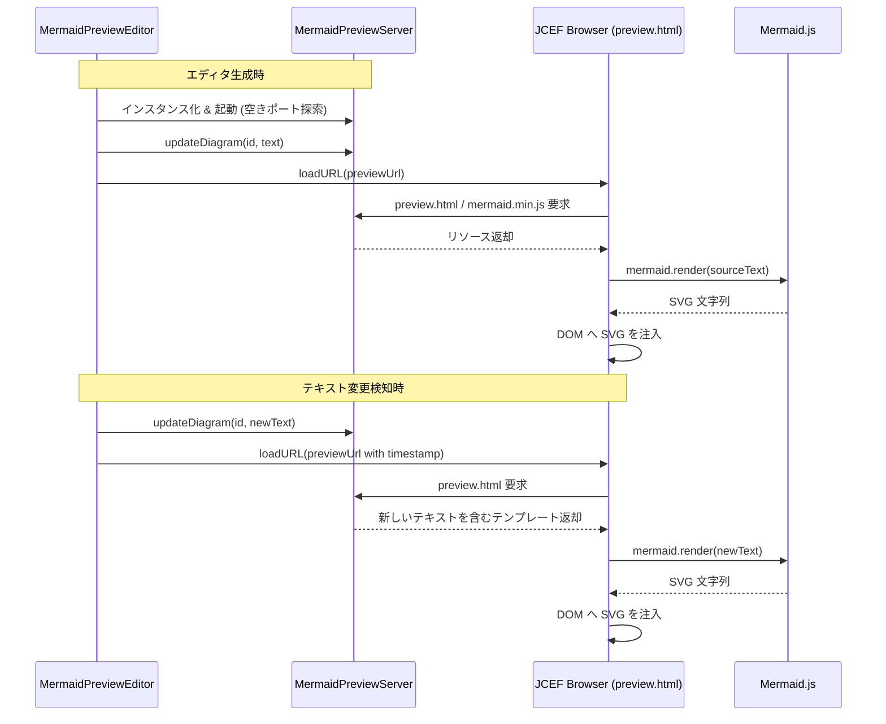

# Siren 仕様書

## 概要
Siren (Simple Renderer for Mermaid) は、Mermaid ダイアグラムのリアルタイムプレビューを提供する IntelliJ IDEA プラグインです。

## 主な機能
- **リアルタイムプレビュー**: `.mermaid` または `.mmd` ファイルの編集に合わせて、ダイアグラムが自動的に更新されます。
- **入力補助機能**: 構文ハイライト、コード補完、ライブテンプレート、コメント機能、括弧のペアリングを提供します。
- **ズーム機能**: レンダリングされたダイアグラムの拡大・縮小に対応しています。
- **統合エディタ**: IntelliJ IDEA のエディタとシームレスに統合されており、通常のテキストエディタの隣にプレビューが表示されます。
- **軽量設計**: レンダリング性能に重点を置いたミニマリストな設計です。

## サポートされるファイル形式
- `.mermaid`
- `.mmd`

## 外部プラグイン連携
- **Markdownプラグイン拡張**: 標準のMarkdownプラグイン内でのMermaid描画を拡張する方法については、[Markdownプラグイン拡張仕様](markdown_extension.md)を参照してください。

## 技術アーキテクチャ

### コンポーネント構成
1. **MermaidFileType / MermaidLanguage**: IntelliJ における Mermaid ファイルの種類と言語サポートを定義します。
2. **MermaidEditorProvider**: Mermaid ファイルを検出し、`MermaidPreviewEditor` を提供します。
3. **MermaidPreviewEditor**: ダイアグラムを表示するための JCEF ブラウザをホストするメイン UI コンポーネントです。ドキュメントの変更を監視し、更新をトリガーします。
4. **MermaidPreviewServer**: HTML テンプレートと Mermaid コンテンツを提供する組み込み HTTP サーバ (`com.sun.net.httpserver.HttpServer` を使用) です。
5. **リソース**:
   - `preview.html`: レンダリングに使用される HTML テンプレート。
- `mermaid.min.js`: Mermaid.js ライブラリ (v11.13.0)。

### 動作フロー
1. Mermaid ファイルが開かれると、`MermaidEditorProvider` が `MermaidPreviewEditor` を生成します。
2. `MermaidPreviewEditor` は、利用可能なポートで `MermaidPreviewServer` を起動します。
3. ユーザがエディタで入力をすると、`DocumentListener` が変更を検知します。
4. エディタは更新されたダイアグラムのテキストを `MermaidPreviewServer` に送信します。
5. `MermaidPreviewServer` は内部状態を更新し、JCEF ブラウザがプレビュー URL をリロードします。
6. ブラウザ内蔵の `preview.html` で `mermaid.render()` が実行され、ダイアグラムが描画されます。

#### 動作シーケンス

## 機能詳細

### 入力補助機能
- Mermaid ダイアグラムを効率的に作成するための各種機能を備えています。詳細は [入力補助機能仕様](input_assistance.md) を参照してください。

### ズーム機能
- プレビュー画面下部のツールバーから、ダイアグラムの拡大・縮小が可能です。
- `preview.html` 内の JavaScript で、レンダリングされた SVG の `viewBox` 属性を基にコンテナの `width` と `height` を動的に計算・変更します。
- ズーム変更ごとに `mermaid_render()` を呼び出すことで、スケールに応じた鮮明なレンダリングを維持します。

## 技術詳細

### サーバー管理とライフサイクル
- `MermaidPreviewServer` は `com.sun.net.httpserver.HttpServer` を使用した軽量な HTTP サーバーです。
- ポートの競合を避けるため、`ServerSocket(0)` を利用して実行時に利用可能なポートを自動的に割り当てます。
- `Disposable` インターフェースを実装しており、エディタが閉じられる際にサーバーの停止とスレッドプールのシャットダウンが確実に行われます。

## 開発とテスト

### ビルドと実行
- Gradle を使用してプロジェクトを管理しています。
- `./gradlew runIde` でプラグインを組み込んだ IntelliJ IDEA 開発版を起動できます。

### テスト
- `./gradlew test` でユニットテストを実行できます。
- テストコードは `src/test/kotlin` に配置されています。

## 依存関係
- IntelliJ Platform SDK
- Mermaid.js v11.13.0
- JCEF (Java Chromium Embedded Framework): レンダリング用
